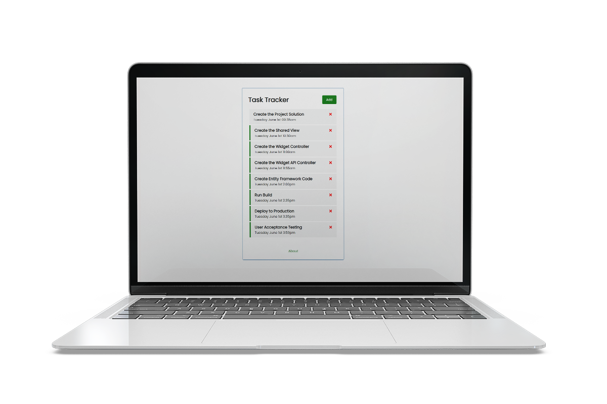
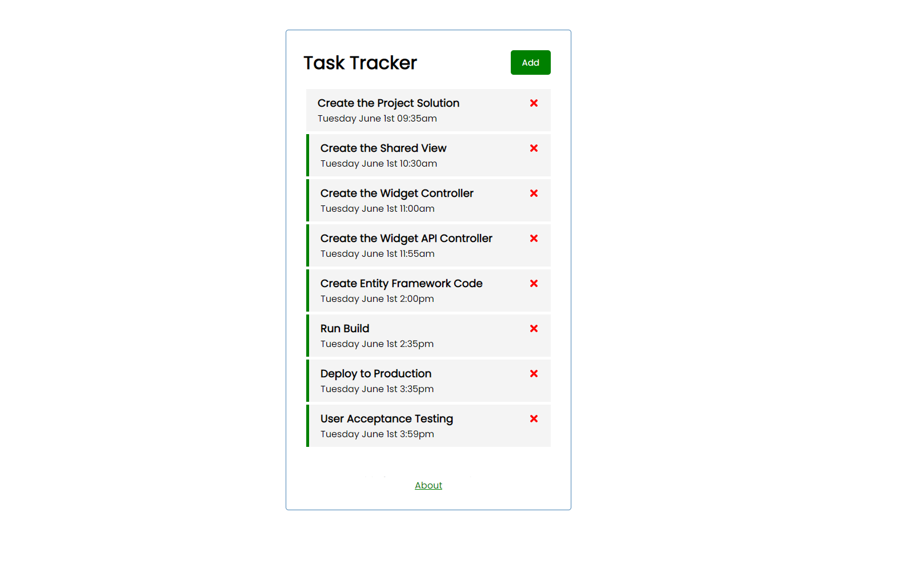

# React Task Tracker

> Simple Task Tracker Application with JSON Server Backend

The application adds/removes tasks from the local JSON file. Perfect example of using:

- [x] useEffect
- [x] useState
- [x] await / async

# Instructions

- clone repo
- run `yarn install`
- run `yarn run server` to start up the JSON Server
- run `yarn run start` to start up the frontend UI

<h1 align="center">

</h1>
